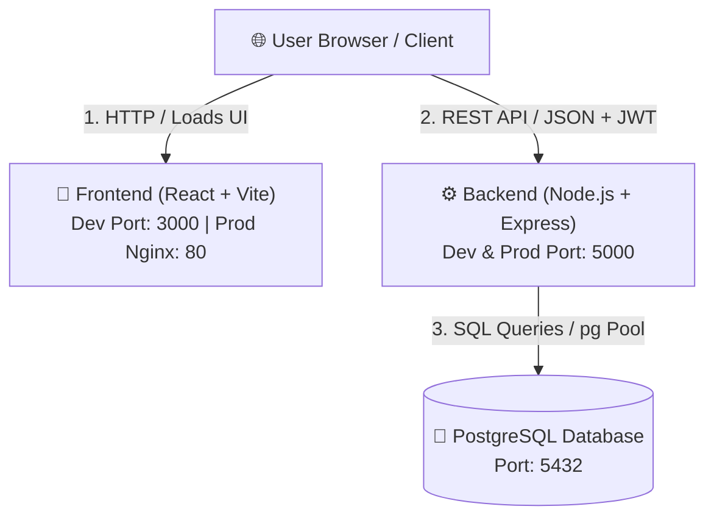

# 🏗️ TaskFlow - Architecture & Network Communication Specification

This document provides a detailed overview of the system architecture, component communication flows, environment variables, network ports, and containerization design for **TaskFlow**.

---

## 1. System Overview & Diagram

TaskFlow follows a standard 3-tier architecture:
1. **Presentation Tier**: React single-page application (SPA) built with Vite.
2. **Application Tier**: Node.js & Express REST API server providing stateless authentication (JWT) and task management endpoints.
3. **Data Tier**: PostgreSQL relational database storing `users` and `tasks`.

---

## 2. Component Communication Breakdown

### A. Client ↔ Backend Communication
- **Protocol**: HTTP/HTTPS (REST API returning JSON).
- **Authentication**: JWT token sent via `Authorization: Bearer <token>` header on protected endpoints.
- **CORS**: Express server enables CORS middleware for cross-origin requests.
- **Port**: Default `5000` (configurable via `PORT` environment variable).

### B. Backend ↔ Database Communication
- **Protocol**: TCP (PostgreSQL wire protocol via `pg` connection pool).
- **Host / Port**: Default host `localhost` (or `db` inside Docker network), default port `5432`.
- **Auto-Initialization**: On startup, backend connects to PostgreSQL and automatically runs SQL table creation (`CREATE TABLE IF NOT EXISTS users ...` and `tasks ...`).

### C. Health Check Endpoint
- **URL**: `GET /health`
- **Purpose**: Used by Docker containers, AWS Target Groups, or load balancers to determine service health.
- **Behavior**: Executes `SELECT 1` against PostgreSQL. Returns HTTP `200 OK` when connected or HTTP `503 Service Unavailable` if database connection fails.

---

## 3. Network Ports & Environment Variables Summary

| Component | Container/Host Port | Environment Variable | Default Value | Role |
| :--- | :--- | :--- | :--- | :--- |
| **Backend API** | `5000` | `PORT` | `5000` | Express REST API |
| **Backend DB Host** | - | `DB_HOST` | `localhost` | Database host (`db` in Docker Compose) |
| **Backend DB Port** | - | `DB_PORT` | `5432` | PostgreSQL port |
| **Backend DB User** | - | `DB_USER` | `taskflow_user` | Database user |
| **Backend DB Pass** | - | `DB_PASSWORD` | `taskflow_secure_password` | Database password |
| **Backend DB Name** | - | `DB_NAME` | `taskflow_db` | Database name |
| **Backend JWT Secret** | - | `JWT_SECRET` | `super_secret_...` | JWT signing secret |
| **Frontend API Base**| `3000` (Dev) / `80` (Prod) | `VITE_API_BASE_URL` | `http://localhost:5000/api` | API Base URL for React app |

---

## 4. Containerization Design Hints (For Your Practice)

When containerizing this application, you can structure your containers as follows:

1. **`db` Container**:
   - Official image: `postgres:15-alpine`
   - Healthcheck: `pg_isready -U ${POSTGRES_USER} -d ${POSTGRES_DB}`

2. **`backend` Container**:
   - Image: `node:20-alpine`
   - Command: `node src/index.js`
   - Environment: Set `DB_HOST=db` (matching the db service name in Docker Compose).

3. **`frontend` Container**:
   - Multi-stage build: Stage 1 builds React assets using `npm run build`; Stage 2 uses `nginx:alpine` to serve static files from `/usr/share/nginx/html`.
   - Nginx reverse proxy configuration can forward requests starting with `/api/` to `http://backend:5000/api/`.
