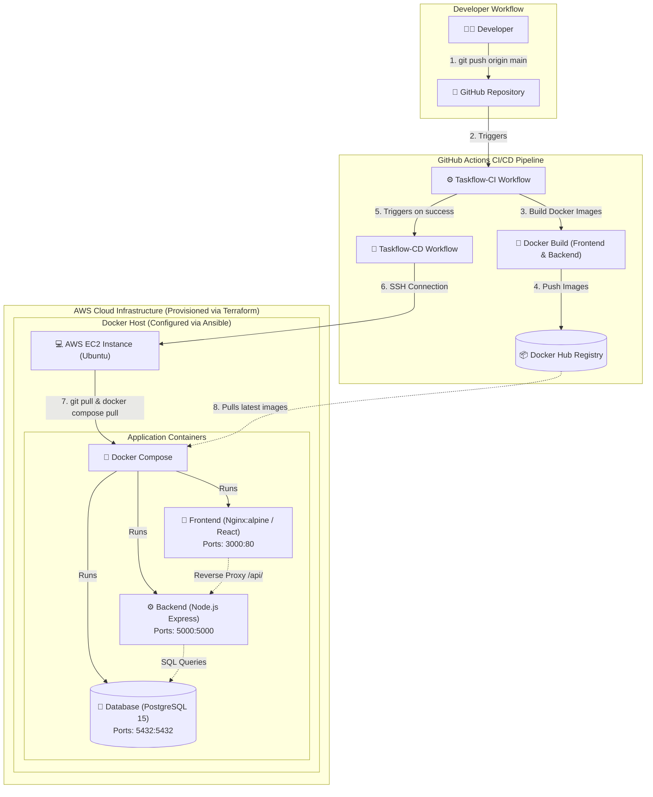

# TaskFlow

**TaskFlow** is a containerized full-stack task management application with automated AWS deployment and CI/CD. Built as a Cloud & DevOps engineering project, it demonstrates modern infrastructure and deployment practices including Infrastructure as Code (IaC), automated server configuration, multi-stage Docker builds, container orchestration, and an automated CI/CD pipeline on AWS.

---

## Architecture



---

## Technology Stack

| Category | Technology | Usage in TaskFlow |
| :--- | :--- | :--- |
| **Application** | React + Vite | Single Page Application (SPA) frontend |
| | Node.js + Express | RESTful API server |
| | PostgreSQL | Relational database for task & user data |
| | JWT + bcryptjs | Authentication & password hashing |
| **Containerization** | Docker | Container runtime & multi-stage builds |
| | Docker Compose | Multi-container orchestration |
| | Nginx | Static web server & API reverse proxy |
| **Cloud Infrastructure** | AWS EC2 | Virtual server hosting the application |
| | AWS Security Groups | Inbound & outbound network firewall rules |
| | Terraform | Infrastructure as Code (IaC) for AWS provisioning |
| **Configuration Management** | Ansible | Automated EC2 server setup & software installation |
| **CI/CD** | GitHub Actions | Automated build & deployment workflows |
| | Docker Hub | Container image registry |

---

## Infrastructure — Terraform

Terraform (`terraform/`) automates AWS infrastructure provisioning:

* **AWS EC2 Instance**: Provisions an Ubuntu server (`t3.micro`) hosting the application stack.
* **AWS Security Group**: Defines inbound firewall rules for SSH (`22`), HTTP (`80`), HTTPS (`443`), and frontend container (`3000`).
* **Default VPC**: Utilizes default AWS VPC networking infrastructure.
* **SSH Key Pair**: Registers public key (`ec2-key.pub`) with AWS for secure SSH access.
* **Terraform Output**: Exports `instance_public_ip` for Ansible inventory and deployment SSH access.

---

## Configuration Management — Ansible

Ansible (`ansible/`) configures the provisioned EC2 host server:

* Updates APT system packages and installs required dependencies (`curl`, `ca-certificates`, `git`).
* Configures the official Docker repository keyring and package source.
* Installs Docker Engine, Docker CLI, containerd, and Docker Compose plugin.
* Enables and starts the systemd `docker` service.
* Adds the remote `ubuntu` user to the `docker` user group for non-root execution.

---

## Docker & Docker Compose

TaskFlow uses containerization to ensure consistent environments across development and production:

* **Frontend Container**:
  * **Multi-stage build**: Stage 1 uses `node:22-alpine` to compile Vite assets; Stage 2 uses `nginx:alpine` to serve static files.
  * **Nginx reverse proxy**: Serves static assets and proxies `/api/*` requests to `http://backend:5000`.
* **Backend Container**: Built on `node:22-alpine`, exposing Express REST API on port `5000`.
* **PostgreSQL Container**: Uses `postgres:15-alpine` with persistent volume (`postgres_data`) and health check (`pg_isready`).
* **Service Dependencies**: Docker Compose manages service startup order, ensuring backend waits for database health (`service_healthy`).

---

## CI/CD

The automated deployment pipeline consists of two linked GitHub Actions workflows (`.github/workflows/`):

```text
git push
   ↓
GitHub Actions CI
   ↓
Build frontend/backend Docker images
   ↓
Push images to Docker Hub
   ↓
CI success
   ↓
GitHub Actions CD
   ↓
SSH to EC2
   ↓
git pull
   ↓
docker compose pull
   ↓
docker compose up -d
```

* **Taskflow-CI**: Triggers on pushes to main, builds frontend and backend Docker images, and publishes them to Docker Hub.
* **Taskflow-CD**: Triggers automatically upon successful completion of `Taskflow-CI`. Establishes an SSH connection to AWS EC2, pulls the latest repository code and updated Docker images, and restarts application containers with `docker compose up -d`.

---

## Project Structure

```text
TaskFlow/
├── .github/
│   └── workflows/
│       ├── taskflow-cd.yml
│       └── taskflow-ci.yml
├── ansible/
│   ├── hosts.ini
│   └── setup.yml
├── backend/
│   ├── src/
│   ├── dockerfile
│   └── package.json
├── frontend/
│   ├── src/
│   ├── dockerfile
│   ├── nginx.conf
│   └── package.json
├── terraform/
│   ├── ec2.tf
│   ├── ec2-key.pub
│   ├── output.tf
│   ├── provider.tf
│   ├── terraform.tf
│   └── variable.tf
├── .gitignore
├── ARCHITECTURE.md
├── docker-compose.yml
└── README.md
```

---

## Local Development

### Prerequisites

* Docker and Docker Compose installed locally.

### Steps to Run

1. **Clone the repository**:
   ```bash
   git clone https://github.com/DrishanDwivedi/TaskFlow.git
   cd TaskFlow
   ```

2. **Start services**:
   ```bash
   docker compose up -d
   ```

3. **Verify running containers**:
   ```bash
   docker compose ps
   ```

4. **Access the application**:
   * **Frontend:** http://localhost:3000
   * **Backend API:** http://localhost:5000
   * **Health Check:** http://localhost:5000/health

5. **Stop services**:
   ```bash
   docker compose down
   ```

---

## AWS Deployment

1. **Provision Infrastructure (Terraform)**:
   ```bash
   cd terraform
   terraform init
   terraform apply
   ```

2. **Configure Server (Ansible)**:
   Update `ansible/hosts.ini` with the generated EC2 public IP:
   ```bash
   cd ansible
   ansible-playbook -i hosts.ini setup.yml
   ```

3. **Deploy via CI/CD**:
   Push code to `main` to trigger automated build, image push, and EC2 deployment:
   ```bash
   git push origin main
   ```

---

## Security Notes

* **GitHub Secrets**: Operational credentials (`DOCKERHUB_USERNAME`, `DOCKERHUB_TOKEN`, `EC2_HOST`, `EC2_SSH_KEY`) are managed securely via repository secrets.
* **Key Exclusions**: Private SSH key files are excluded from Git via `.gitignore`.
* **Environment Credentials**: Database credentials in `docker-compose.yml` are development defaults and should be replaced with proper secret management for production deployments.

---

## Future Improvements

* **HTTPS / SSL**: Configure Nginx with Let's Encrypt / Certbot and a custom domain.
* **External Secret Management**: Integrate AWS Secrets Manager or HashiCorp Vault.
* **Remote Terraform State**: Store Terraform state in AWS S3 with S3 native state locking.
* **Monitoring & Logging**: Deploy Prometheus, Grafana, and CloudWatch log aggregation.
* **Versioned Image Tags & Rollbacks**: Use Git commit SHAs for container tagging to support automated rollbacks.
* **High Availability & Autoscaling**: Implement AWS Application Load Balancers (ALB) and Auto Scaling Groups.
