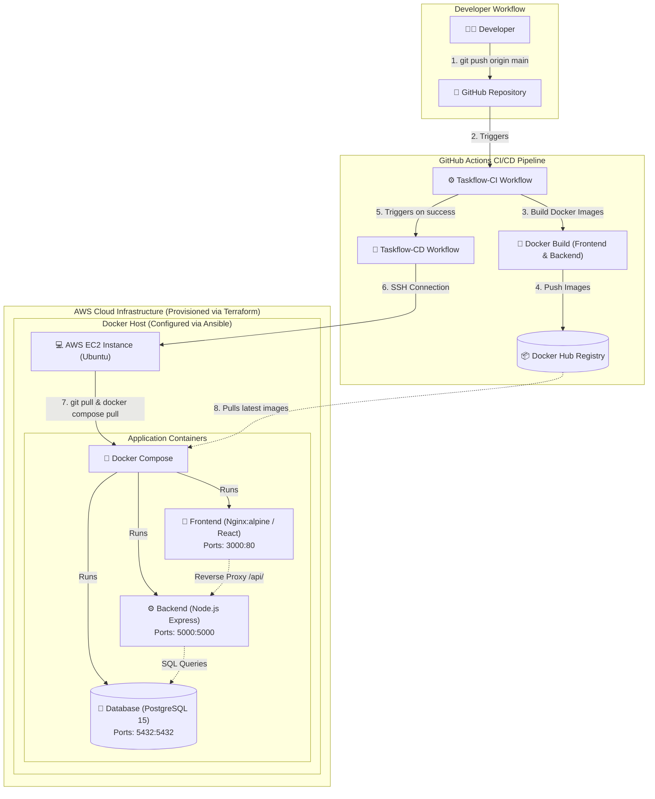

# TaskFlow

**A containerized full-stack task management application with automated AWS deployment and CI/CD.**

---

## 1. Project Overview

**TaskFlow** is a full-stack task management application built primarily as a **Cloud & DevOps engineering project**. While the user-facing application is a clean task management system, the primary engineering focus of this repository is demonstrating modern DevOps practices—including Infrastructure as Code (IaC), automated server configuration management, multi-stage Docker containerization, container orchestration, and an automated continuous integration and continuous deployment (CI/CD) pipeline on Amazon Web Services (AWS).

The application consists of three primary tiers:
* **Frontend**: React (built with Vite) served via Nginx reverse proxy.
* **Backend**: Node.js and Express RESTful API with JWT authentication.
* **Database**: PostgreSQL relational database for persistent user and task data.

Rather than manual deployments, TaskFlow leverages **Terraform** for AWS infrastructure provisioning, **Ansible** for host initialization and software configuration, and **GitHub Actions** with **Docker Hub** for automated build and SSH-based deployment to AWS EC2.

---

## 2. DevOps Architecture

The deployment architecture separates cloud infrastructure management, server configuration, continuous integration, and continuous deployment into distinct, automated layers:

1. **Infrastructure Provisioning**: Terraform provisions an AWS EC2 instance, security group rules, SSH keys, and networking within the default VPC.
2. **Configuration Management**: Ansible connects to the EC2 instance over SSH, configures the Docker repository, installs Docker Engine and Docker Compose, and sets up user permissions.
3. **Continuous Integration (CI)**: On every push to the `main` branch, GitHub Actions executes `Taskflow-CI`, building multi-stage Docker images for both frontend and backend services and pushing them to Docker Hub.
4. **Continuous Deployment (CD)**: Upon successful CI completion, GitHub Actions triggers `Taskflow-CD`, establishing an SSH connection to the AWS EC2 host to pull the latest repository changes, fetch updated Docker images from Docker Hub, and launch the application containers using Docker Compose.



---

## 3. Technology Stack

| Category | Technology | Usage in TaskFlow |
| :--- | :--- | :--- |
| **Application** | React + Vite | Single Page Application (SPA) frontend |
| | Node.js + Express | RESTful API server |
| | PostgreSQL | Relational database (users & tasks schema) |
| | JWT + bcryptjs | Token-based authentication and password hashing |
| **Containerization** | Docker | Container runtime & multi-stage image builds |
| | Docker Compose | Multi-container service orchestration |
| | Nginx | High-performance static web server & reverse proxy |
| **Cloud Infrastructure** | AWS EC2 | Linux compute instance hosting the application |
| | AWS Security Groups | Network firewall controlling ingress/egress ports |
| | Terraform | Infrastructure as Code (IaC) tool for AWS provisioning |
| **Configuration Management**| Ansible | Automated server configuration & software installation |
| **CI/CD** | GitHub Actions | Automated build and deployment workflows|
| | Docker Hub | Public/private container image registry |
| **Version Control** | Git & GitHub | Source code management & pipeline triggers |

---

## 4. Infrastructure as Code — Terraform

Infrastructure provisioning is fully automated using **Terraform** (`terraform/` directory), eliminating manual configuration in the AWS Management Console and ensuring reproducible infrastructure.

### Resources Managed by Terraform

* **AWS EC2 Instance (`aws_instance.my_instance`)**:
  * Instance Type: `t3.micro` (configurable via `var.instance_type`)
  * AMI: Ubuntu Server (`ami-0b6d9d3d33ba97d99` default)
  * Storage: 8 GB `gp3` root EBS volume
  * Tagging: `Name = "Taskflow-Server"`
* **AWS Security Group (`aws_security_group.my_sg`)**:
  * Inbound Port `22` (SSH for Ansible management and CD deployment)
  * Inbound Port `80` (HTTP web traffic)
  * Inbound Port `443` (HTTPS web traffic)
  * Inbound Port `3000` (Direct frontend container exposure)
  * Outbound `0.0.0.0/0` (Unrestricted egress for updates and Docker image pulls)
* **AWS Default VPC (`aws_default_vpc.default`)**:
  * Utilizes default AWS VPC infrastructure for simplified networking.
* **SSH Key Pair (`aws_key_pair.my_key`)**:
  * Registers public key `ec2-key.pub` with AWS for secure SSH key-based access.
* **Terraform Outputs (`output.tf`)**:
  * Outputs `instance_public_ip` after successful provisioning for Ansible inventory and SSH connection mapping.

---

## 5. Configuration Management — Ansible

While Terraform provisions the cloud infrastructure, **Ansible** (`ansible/` directory) handles server configuration and software provisioning once the EC2 instance is running.

### Server Provisioning Tasks (`ansible/setup.yml`)

1. **System Updates**: Refreshes APT package cache (`apt update_cache`).
2. **Prerequisites Installation**: Installs `ca-certificates`, `curl`, and `git`.
3. **Docker Official Repository Setup**: Creates keyrings directory, fetches Docker GPG key (`docker.asc`), and configures the deb822 repository.
4. **Engine & Plugin Installation**: Installs `docker-ce`, `docker-ce-cli`, `containerd.io`, `docker-buildx-plugin`, and `docker-compose-plugin`.
5. **Service Management**: Enables and starts the systemd `docker` service.
6. **User Permissions**: Adds the target remote user (`ubuntu`) to the `docker` user group to execute Docker commands without `sudo`.

---

## 6. Dockerization

TaskFlow uses containerization to ensure consistency across local development and production environments.

### Service Decomposition

* **Frontend Container (`drishandwivedi/taskflow-frontend:latest`)**:
  * **Multi-Stage Build**:
    * *Stage 1 (Builder)*: Uses `node:22-alpine` to install npm dependencies and compile Vite static assets (`npm run build` → `/app/dist`).
    * *Stage 2 (Production)*: Uses `nginx:alpine` to copy `/app/dist` into `/usr/share/nginx/html`.
  * **Nginx Reverse Proxy (`nginx.conf`)**:
    * Serves static frontend assets for all client routes (`try_files $uri $uri/ /index.html`).
    * Proxies requests prefixed with `/api/` to `http://backend:5000` with HTTP headers passed.
* **Backend Container (`drishandwivedi/taskflow-backend:latest`)**:
  * Built from `node:22-alpine` lightweight base image.
  * Exposes port `5000` and executes `npm start` (`node src/index.js`).
* **Database Container (`postgres:15-alpine`)**:
  * Official PostgreSQL 15 Alpine image.
  * Uses persistent volume `postgres_data` mapped to `/var/lib/postgresql/data`.
  * Implements explicit health checking via `pg_isready -U taskflow -d taskflow`.

### Docker Compose Orchestration (`docker-compose.yml`)

`docker-compose.yml` ties the services together on a shared virtual network:
* `frontend` exposes port `3000:80` and depends on `backend`.
* `backend` exposes port `5000:5000`, receives DB connection environment variables (`DB_HOST=db`, `DB_USER`, `DB_PASSWORD`, `DB_NAME`), and depends on `db` condition `service_healthy`.
* `db` runs on port `5432:5432` with automated container health checking.

---

## 7. CI Pipeline (Taskflow-CI)

The Continuous Integration workflow (`.github/workflows/taskflow-ci.yml`) automates image creation whenever code is pushed to the repository.

* **Trigger**: `push` event on branch `main`.
* **Execution Environment**: `ubuntu-latest`.
* **Pipeline Steps**:
  1. **Checkout**: Retrieves repository code via `actions/checkout@v4`.
  2. **Docker Setup**: Configures Docker build tools via `docker/setup-docker-action@v5`.
  3. **Docker Hub Authentication**: Authenticates with Docker Hub using `secrets.DOCKERHUB_USERNAME` and `secrets.DOCKERHUB_TOKEN` via `docker/login-action@v4`.
  4. **Backend Build & Push**: Builds image from `./backend` context and pushes `taskflow-backend:latest` to Docker Hub via `docker/build-push-action@v7`.
  5. **Frontend Build & Push**: Builds image from `./frontend` context and pushes `taskflow-frontend:latest` to Docker Hub via `docker/build-push-action@v7`.

---

## 8. CD Pipeline (Taskflow-CD)

The Continuous Deployment workflow (`.github/workflows/taskflow-cd.yml`) automates remote deployment to AWS EC2 once CI completes successfully.

* **Trigger**: `workflow_run` event when `Taskflow-CI` completes with `conclusion == 'success'`.
* **Execution Environment**: `ubuntu-latest`.
* **Pipeline Steps**:
  1. **SSH Connection**: Uses `appleboy/ssh-action@v1` to establish a secure SSH session to the EC2 host using `secrets.EC2_HOST`, username `ubuntu`, and `secrets.EC2_SSH_KEY`.
  2. **Repository Synchronisation**:
     * If `/opt/taskflow` does not exist, clones the repository (`git clone`).
     * If already present, executes `sudo git pull origin main`.
  3. **Container Update**:
     * Navigates to `/opt/taskflow`.
     * Executes `sudo docker compose pull` to fetch newly published images from Docker Hub.
     * Executes `sudo docker compose up -d` to recreate containers with updated application images.

### Key Difference Between CI and CD in TaskFlow

* **CI (Continuous Integration)**: Builds the frontend and backend Docker images and publishes container artifacts to Docker Hub.
* **CD (Continuous Deployment)**: Orchestrates operational deployment by connecting to live cloud infrastructure (AWS EC2) via SSH, updating application source code, and reloading running containers.

---

## 9. Deployment Flow

```text
git push
   ↓
GitHub Actions CI
   ↓
Docker build
   ↓
Docker Hub
   ↓
CI success
   ↓
GitHub Actions CD
   ↓
SSH → AWS EC2
   ↓
git pull
   ↓
docker compose pull
   ↓
docker compose up -d
   ↓
TaskFlow deployed
```

---

## 10. Project Structure

```text
TaskFlow/
├── .github/
│   └── workflows/
│       ├── taskflow-cd.yml
│       └── taskflow-ci.yml
├── ansible/
│   ├── hosts.ini
│   └── setup.yml
├── backend/
│   ├── src/
│   │   ├── config/
│   │   │   └── db.js
│   │   ├── middleware/
│   │   │   └── auth.js
│   │   ├── routes/
│   │   │   ├── auth.js
│   │   │   ├── health.js
│   │   │   └── tasks.js
│   │   └── index.js
│   ├── .env.example
│   ├── dockerfile
│   └── package.json
├── frontend/
│   ├── src/
│   │   ├── api/
│   │   │   └── client.js
│   │   ├── components/
│   │   │   ├── AuthModal.jsx
│   │   │   ├── Dashboard.jsx
│   │   │   ├── Navbar.jsx
│   │   │   ├── TaskCard.jsx
│   │   │   ├── TaskFilter.jsx
│   │   │   └── TaskModal.jsx
│   │   ├── App.jsx
│   │   ├── index.css
│   │   └── main.jsx
│   ├── .env.example
│   ├── dockerfile
│   ├── index.html
│   ├── nginx.conf
│   ├── package.json
│   └── vite.config.js
├── terraform/
│   ├── ec2.tf
│   ├── ec2-key.pub
│   ├── output.tf
│   ├── provider.tf
│   ├── terraform.tf
│   └── variable.tf
├── .gitignore
├── ARCHITECTURE.md
├── docker-compose.yml
└── README.md
```

---

## 11. Local Development

You can run the full TaskFlow application stack locally using Docker Compose.

### Prerequisites

* Docker and Docker Compose installed locally.

### Steps to Run

1. **Clone the repository**:
   ```bash
   git clone https://github.com/DrishanDwivedi/TaskFlow.git
   cd TaskFlow
   ```

2. **Start services with Docker Compose**:
   ```bash
   docker compose up -d
   ```

3. **Verify running containers**:
   ```bash
   docker compose ps
   ```

4. **Access the application**:
   * **Frontend UI**: `http://localhost:3000`
   * **Backend API**: `http://localhost:5000`
   * **Health Check**: `http://localhost:5000/health`
   * **PostgreSQL Database**: `localhost:5432`

5. **Stop services**:
   ```bash
   docker compose down
   ```

---

## 12. Production Deployment

The high-level production deployment sequence follows these steps:

1. **Provision EC2 Instance using Terraform**:
   ```bash
   cd terraform
   terraform init
   terraform apply
   ```
2. **Configure EC2 Host using Ansible**:
   Update `ansible/hosts.ini` with the generated EC2 public IP, then execute:
   ```bash
   cd ansible
   ansible-playbook -i hosts.ini setup.yml
   ```
3. **Push Code to GitHub**:
   ```bash
   git push origin main
   ```
4. **Automated CI Build**:
   GitHub Actions CI builds the frontend and backend Docker images and pushes them to Docker Hub.
5. **Automated CD Deployment**:
   GitHub Actions CD SSHs into the AWS EC2 instance, pulls the latest code and Docker images, and restarts the containers using `docker compose up -d`.

---

## 13. Security Notes

* **GitHub Secrets**: Sensitive operational credentials (`DOCKERHUB_USERNAME`, `DOCKERHUB_TOKEN`, `EC2_HOST`, `EC2_SSH_KEY`) are stored in GitHub Actions Secrets rather than committed to the repository.
* **Key Pair Security**: Terraform SSH private keys (`ec2-key`) are strictly excluded from version control via `.gitignore`.
* **Database Credentials**: Database credentials currently defined in `docker-compose.yml` are development/demo credentials and should be replaced with proper secret/environment variable management for a production deployment.
* **No Secret Exposure**: Plaintext secret keys or passwords are not exposed or printed in this documentation.

---

## 14. Learning / DevOps Outcomes

This project demonstrates practical skills in modern Cloud and DevOps engineering:

* Infrastructure as Code (IaC) with Terraform
* Linux server configuration and software provisioning with Ansible
* AWS EC2 instance lifecycle and Security Group networking management
* Multi-stage Docker image builds and containerization
* Multi-container service orchestration with Docker Compose
* Automated CI/CD pipeline development with GitHub Actions
* Container image registry management with Docker Hub
* SSH-based remote deployment automation
* Git version control and repository workflow management
* Automated end-to-end cloud deployment architecture

---

## 15. Future Improvements

* **HTTPS & SSL Termination**: Configure Nginx with Let's Encrypt / Certbot and a custom domain.
* **External Secret Management**: Replace static environment credentials with AWS Secrets Manager or HashiCorp Vault.
* **Remote Terraform State**: Store Terraform state remotely in AWS S3 with DynamoDB state locking.
* **Monitoring & Logging**: Deploy Prometheus, Grafana, and CloudWatch agent for operational metrics and log aggregation.
* **Automated Rollback & Versioned Tags**: Use Git commit SHAs for container image tagging instead of `:latest` to enable automated rollbacks.
* **High Availability & Autoscaling**: Implement AWS Application Load Balancers (ALB) and Auto Scaling Groups for multi-node deployments.

---

TaskFlow was built as a hands-on Cloud/DevOps project to demonstrate the complete journey from infrastructure provisioning to automated application deployment.
